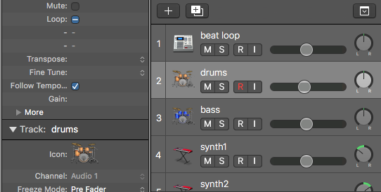

## Welcome to Kelly's MUSC B30 Project Website

For our first assignment, we were required to create the song “Get Dancing.”  So long as we are doing this correctly, everyone’s should turn out the same, though we are allowed to include extra tracks if we should so wish.

In beginning the project, I did not know how to create screenshots, so I have no visual representation for most of the arranging process.  That said, we were to use the loops “Good Life Beat,” “Skyline Bass,” “Fine Line Beat,” “Barricade Arpeggio,” “Deal Breaker Arpeggio,” and “Skyline Piano,” tweaking all of these such that they have the same tempo.  Then, we practiced looping and editing, in order to assure that the tracks would occur when they were supposed to and be the appropriate length.  The final result of this arrangement is seen below.

From this point on, we’re working largely with the Mixer.  First, we were told to change the names of the individual tracks, just to give us practice with this process.  I started out with fake names, just for my amusement.

Next, we were told to change the icon of track 2, again just for practice.  I found that the easiest way to do this was to simply click on the icon in the Inspector menu to the left, rather than control-click the icon on the track, but whichever way works for you is best.

Then, we were told to bring up the Mixer and make it as large as possible.

We cycled a particular portion of the song and adjusted the volume of the synthesizer tracks, as well as which headphone they would come out of using the Pan knob.

The Pan knob took some getting used to.  I eventually found that clicking and dragging upward would turn the knob clockwise, while dragging downward would turn it counterclockwise.  Originally, I was trying to drag in the direction of the knob, and that did not achieve the desired result.

After adjusting these aspects, we began working with Plug-Ins.  This is the Plug-In we chose for the bass track.

We also added a plug-in to the piano track.

With all of this. The essentials of the project were complete.  Now it was time to bounce.

As a GarageBand user (who is generally bad at technology), I was unfamiliar with the term “bounce.”  However, I found that it is generally like exporting a project to mp3.  This is what the Bounce menu looks like.

Thus, the project was complete, but the song wasn’t particularly original.  I decided on my own to add an extra track, a recording.  I borrowed a microphone and added a tack of whistling into the project.

Recording was slightly awkward—I had to click not only the top Record button, but also the little red “R” next to the track icon.  I recorded my track from the beginning of the song, then used the techniques we learned earlier in the assignment to cut off the beginning and end of the track, leaving only the bit with sound.  It eventually looked like this.

Another bounce, and the song was finished.  Here is the result.

[Get Dancing+](/Audio/GetDancingKGBplus.mp3)

An additional tip for those unfamiliar with a Macintosh: when you wish to hide a window without closing it, there’s a little yellow button next to the red x-ing out button.  That’s the “hide” button.  To retrieve the window, just click on it in the toolbar at the bottom of the screen.
